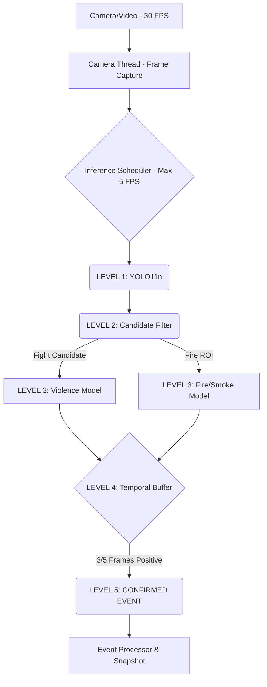

# Multi-Model Video Event Detection Pipeline

Đây là hệ thống phân tích video/camera luồng thời gian thực sử dụng kiến trúc **5-Level Cascade** để tự động nhận diện các sự kiện bất thường như bạo lực (Fight) và hỏa hoạn (Fire/Smoke) với hiệu năng cao, tiêu thụ ít tài nguyên.

## 🏗️ Sơ đồ Kiến trúc (5-Level Cascade)



## 🚀 Tính năng Cốt lõi
- **Tiết kiệm tài nguyên:** Thay vì chạy mọi frame qua model AI nặng, hệ thống dùng YOLO11n và Color Heuristic làm bộ lọc ứng viên (Candidate Filter). Mô hình chuyên sâu chỉ được gọi khi có nghi vấn.
- **Không có độ trễ dồn (Zero Frame Queue):** Đọc stream và inference chạy trên 2 thread tách biệt. Frame quá hạn sẽ bị Drop để đảm bảo độ trễ AI luôn ở thì hiện tại.
- **Chống nhiễu (Temporal Buffer):** Tích hợp điểm FireScore phức hợp và hệ thống điểm danh 3/5 khung hình để ngăn báo động giả (False Positives).

## 📂 Cấu trúc thư mục
- `models/`: Chứa các interface model và code tải trọng số AI (YOLO, Violence, Fire).
- `pipeline/`: Chứa vòng lặp lõi, logic tiền xử lý và hậu xử lý luồng AI.
- `utils/`: Log hiệu suất phần cứng (RAM/CPU).
- `tests/`: Bộ Unit Test kiểm chứng sự ổn định của luồng.

## ⚙️ Cài đặt & Sử dụng
1. **Chuẩn bị file weights** tại `weights/yolov8n.pt`, `weights/best_violence_model.pth`, và `weights/fire_smoke/model.h5`.
2. **Chạy ứng dụng:**
```bash
python main.py --video "đường_dẫn_video.mp4"
# hoặc
python main.py --video "rtsp://..."
```

## 🛡️ Self-Test
Dự án được bảo vệ chặt chẽ bởi bộ Pytest:
```bash
python -m pytest tests/
```
